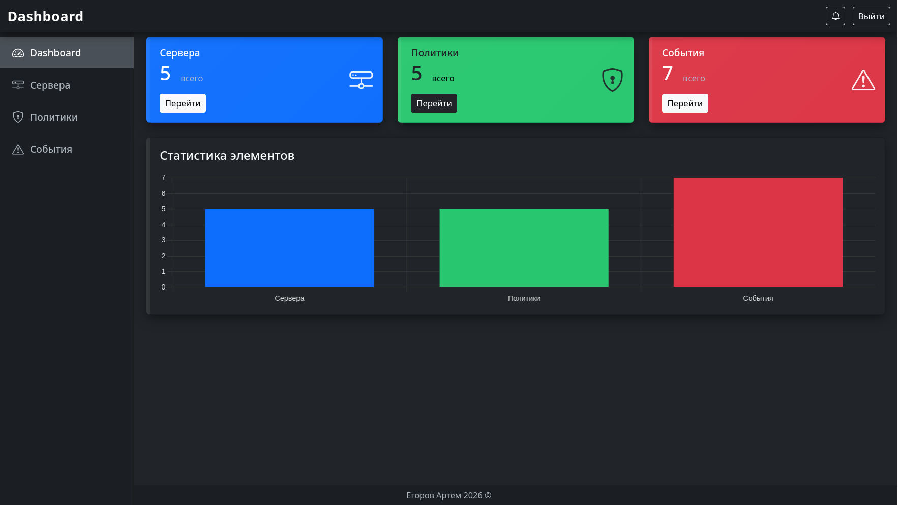
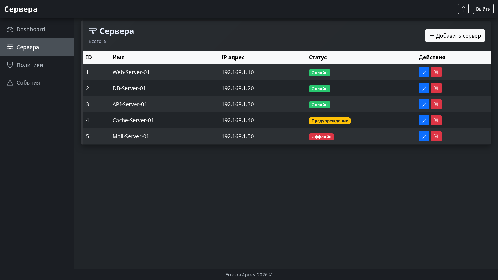
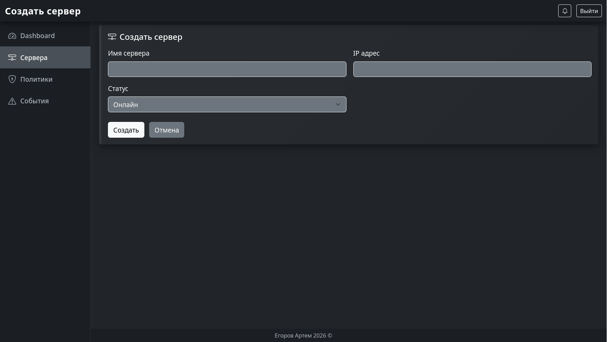
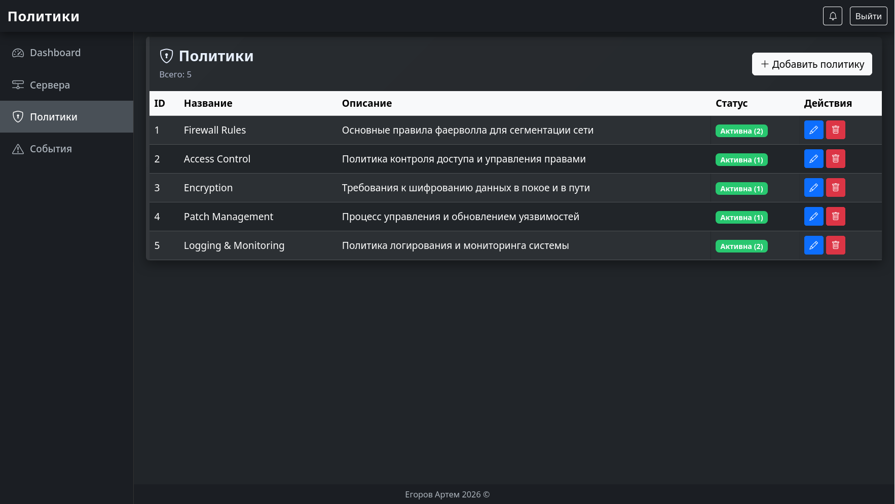
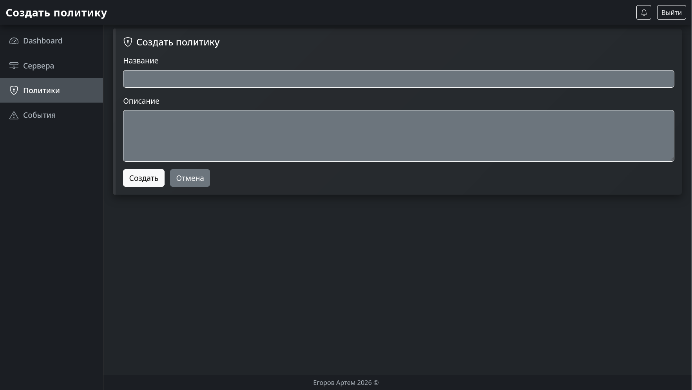
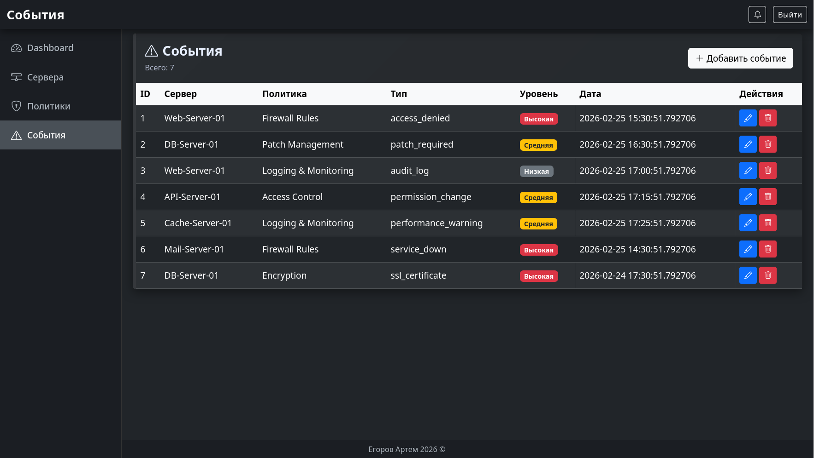
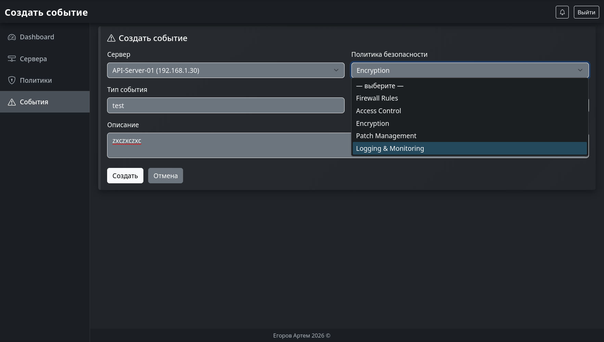

Егоров Артем Алексеевич

Студент группы - ИС-43

Сроки прохождения практики - 16.02.2026 по 01.03.2026

Тема практики - Администрирование информационных ресурсов

# Система мониторинга ИБ

Веб-приложение для управления и мониторинга безопасности инфраструктуры серверов.

## Возможности

- **Dashboard** — панель мониторинга с KPI карточками и графиками
- **Управление серверами** — добавление, редактирование, удаление серверов
- **Политики безопасности** — создание и управление политиками безопасности
- **События безопасности** — логирование и отслеживание событий безопасности

## Технологический стек

- **Backend**: FastAPI
- **Frontend**: Bootstrap 5.3.3 + Jinja2 шаблоны
- **БД**: SQLAlchemy + SQLite
- **Графики**: Chart.js

## Установка

```bash
# Клонировать репозиторий
git clone https://github.com/artemventvent/PP-10.git
cd Src

# Установить зависимости
pip install -r requirements.txt

# Заполнить БД тестовыми данными
python seed_data.py

# Запустить приложение
uvicorn main:app --reload
```

Приложение будет доступно по адресу: `http://localhost:8000`

## Структура проекта

```
.
├── main.py              # Основное приложение и маршруты
├── models.py            # SQLAlchemy модели
├── database.py          # Конфигурация БД
├── schemas.py           # Pydantic схемы
├── seed_data.py         # Скрипт для заполнения БД
├── templates/           # Jinja2 шаблоны
│   ├── base.html        # Базовый шаблон (navbar, sidebar, footer)
│   ├── dashboard.html   # Главная страница
│   ├── servers.html     # Список серверов
│   ├── server_form.html # Форма сервера
│   ├── policies.html    # Список политик
│   ├── policy_form.html # Форма политики
│   ├── events.html      # Список событий
│   └── event_form.html  # Форма события
├── routers/             # Дополнительные маршруты (опционально)
└── db.sqlite3           # База данных
```

## Модели данных

### Server
- `id` — уникальный идентификатор
- `name` — название сервера
- `ip_address` — IP адрес
- `status` — статус (online, offline, warning)
- `created_at` — время создания

### SecurityPolicy
- `id` — уникальный идентификатор
- `name` — название политики
- `description` — описание

### SecurityEvent
- `id` — уникальный идентификатор
- `server_id` — связь с серверанм
- `policy_id` — связь с политикой
- `event_type` — тип события
- `severity` — уровень серьезности (low, medium, high)
- `description` — описание события
- `timestamp` — время события

### Service
- `id` — уникальный идентификатор
- `server_id` — связь с сервером
- `name` — название сервиса
- `status` — статус сервиса (running, stopped)

## API маршруты

### Dashboard
- `GET /` — главная страница с KPI

### Серверы
- `GET /servers` — список серверов
- `GET /servers/create` — форма создания сервера
- `POST /servers/create` — создать сервер
- `GET /servers/edit/{id}` — форма редактирования
- `POST /servers/edit/{id}` — обновить сервер
- `POST /servers/delete/{id}` — удалить сервер

### Политики
- `GET /policies` — список политик
- `GET /policies/create` — форма создания
- `POST /policies/create` — создать политику
- `GET /policies/edit/{id}` — форма редактирования
- `POST /policies/edit/{id}` — обновить политику
- `POST /policies/delete/{id}` — удалить политику

### События
- `GET /events` — список событий
- `GET /events/create` — форма создания события
- `POST /events/create` — создать событие
- `GET /events/edit/{id}` — форма редактирования
- `POST /events/edit/{id}` — обновить событие
- `POST /events/delete/{id}` — удалить событие

---

## Примеры страниц

### Dashboard — Панель мониторинга

Главная страница приложения с KPI карточками, отображающими количество серверов, политик и событий безопасности. Содержит интерактивный график со статистикой.

**Скриншот:**



**Особенности:**
- Карточки с основными метриками (Сервера, Политики, События)
- График со статистикой элементов
- Быстрая навигация к разделам

---

### Сервера — Управление серверами

Страница для просмотра, добавления и редактирования серверов инфраструктуры. Отображает таблицу со всеми серверами, их IP адресами и текущим статусом.

**Скриншот:**



**Функции:**
- Таблица со списком всех серверов
- Информация: ID, Имя, IP адрес, Статус
- Кнопки для редактирования и удаления
- Кнопка "Добавить сервер" для создания нового

---

### Форма сервера — Создание/Редактирование

Форма для добавления нового сервера или редактирования существующего с полями для названия, IP адреса и статуса.

**Скриншот:**



**Поля:**
- Имя сервера
- IP адрес
- Статус (online, offline, warning)

---

### Политики — Управление политиками безопасности

Страница для управления политиками безопасности. Отображает таблицу со всеми созданными политиками и их описаниями.

**Скриншот:**



**Функции:**
- Таблица со списком всех политик
- Информация: ID, Название, Описание
- Кнопки для редактирования и удаления
- Кнопка "Добавить политику"

---

### Форма политики — Создание/Редактирование

Форма для создания новой политики или редактирования существующей с названием и описанием.

**Скриншот:**



**Поля:**
- Название политики
- Описание

---

### События — Логирование событий безопасности

Страница для просмотра всех зафиксированных событий безопасности. Отображает таблицу с информацией о событиях, их типе, серьезности и сервере.

**Скриншот:**



**Функции:**
- Таблица со списком всех событий
- Информация: ID, Сервер, Событие, Политика, Тип, Серьезность
- Фильтрация по серьезности (высокая, средняя, низкая)
- Кнопки для редактирования и удаления
- Кнопка "Добавить событие"

---

### Форма события — Создание/Редактирование

Форма для логирования нового события безопасности или редактирования существующего.

**Скриншот:**



**Поля:**
- Сервер (выпадающий список)
- Политика (выпадающий список)
- Тип события
- Уровень серьезности (low, medium, high)
- Описание

---

## Использование

1. **Добавить сервер** — перейти в раздел "Сервера" и нажать кнопку "Добавить сервер"
2. **Создать политику** — перейти в раздел "Политики" и создать новую
3. **Логировать события** — в разделе "События" добавлять новые события безопасности
4. **Просмотреть статистику** — на Dashboard отображаются KPI и графики

## Требования

- Python 3.8+
- pip
